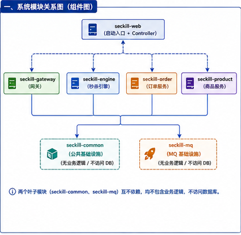
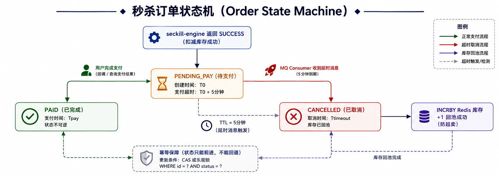
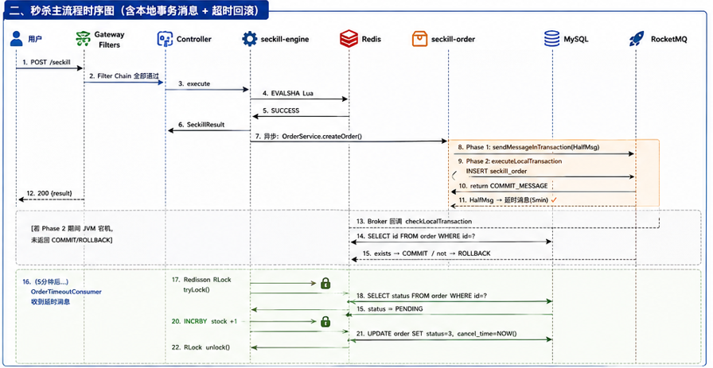
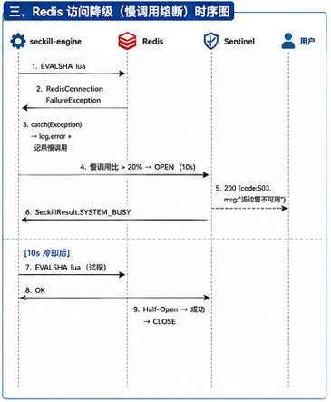
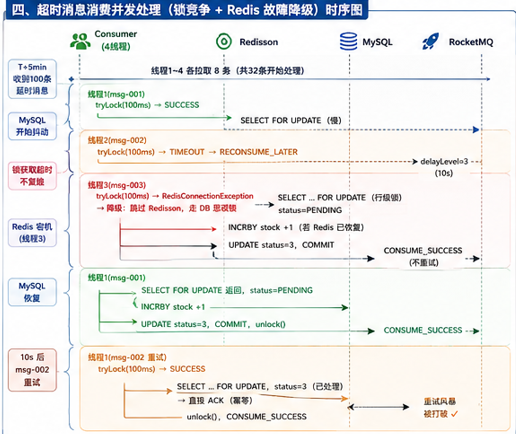
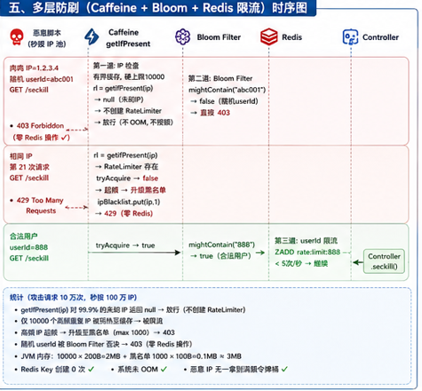
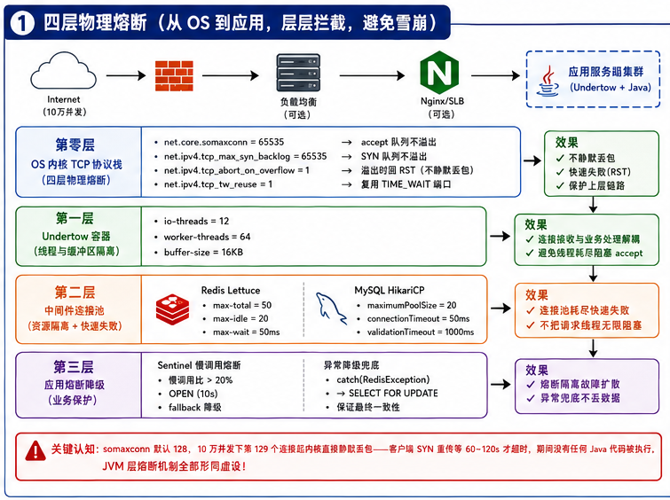
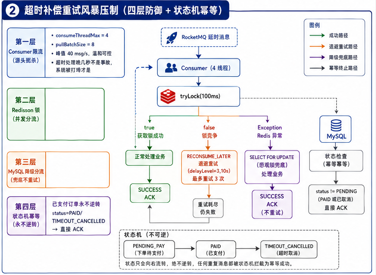
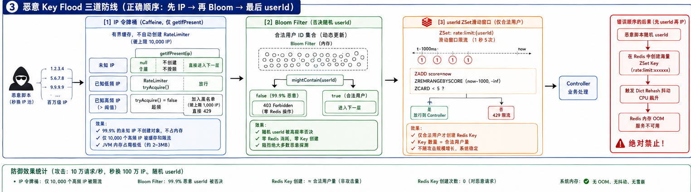

# 需求分析


秒杀是**一场用极小成本换取极大流量的营销活动。** 这决定它有两条不可逾越的红线：
1. **绝对不能超卖**
2. **绝对不能影响其他业务**


## 场景 1：活动预热与倒计时阶段

- **服务端倒计时统一**：用户看到的开抢倒计时必须以服务端时间为准，客户端本地时间不可信。倒计时归零前，任何抢购请求均为无效。
- **购买入口动态化**：抢购的真实 URL 在倒计时结束瞬间才由服务端生成并下发。未到时间点，任何人无法提前构造或猜解购买链接，从源头阻断脚本批量预请求。
- **多商品独立运营**：同一场活动可同时售卖多个商品（如 100 台手机、200 个台灯、400 个牙刷），每种商品有独立库存。热门商品的抢购压力不得波及冷门商品用户的正常购买体验。
- **全场限购一件**：每个用户在整个活动期间只能成功购买一件商品。若用户同时发起多商品抢购，仅保留最先命中库存的那一单，其余全部拦截。抢购失败后，用户可继续尝试购买——但一旦成功，立即锁定，不可再抢。

---

## 场景 2：开闸瞬间——海量并发与库存争夺

- **10 万人抢 100 件，毫秒级判决**：开闸瞬间约 10 万并发请求涌入，争抢仅 100 件真实库存。系统须在毫秒内完成全部判决——抢到的进入下单流程，抢不到的（约 99,900 人）立刻收到明确的"已售罄"结果，禁止出现转圈等待或排队阻塞。
- **热门商品的负荷分散**：对于预期极度抢手的单品，将全部库存预拆为多个等额份额并分散管理。每位用户被随机分配到一个份额组内竞争。原本 10 万人争一个入口，变为 10 个 1 万人的小组各自竞争，从而避免单一热点被打垮。
- **库存扣减的绝对正确性**：任何场景下、任意并发程度下，"已售数量 ≤ 实际库存"这一约束必须数学级严格成立。不允许出现两人同时抢到最后一件的情况。

---

## 场景 3：下单后的支付时效与库存回收

- **限时支付锁定**：抢到购买资格后，该件商品被暂时锁定。用户须在规定时间（如 5 分钟）内完成支付。超时未支付，订单自动取消，锁定即刻解除。
- **静默回池与"捡漏"**：超时释放的库存不主动通知任何人，而是直接、静默地退回可售库存池。此时仍在反复尝试下单的用户，有几率直接命中这笔回流库存，实现自然的"捡漏"交易。
- **超时自动释放**：超时订单的取消与库存回池必须自动完成，无需人工或定时脚本介入。

---

## 场景 4：恶意流量与反欺诈

- **高频访问自动拦截**：对同一用户或同一来源的异常高频请求，在入口处即予以熔断，不得穿透至后端交易系统。
- **流量水位自适应验证**：当系统整体负载触及警戒线时，自动对后续请求追加人机验证（算术题 / 滑块验证码）。利用真人完成验证的 1~3 秒自然耗时，将瞬间峰值的请求在时间轴上均匀摊开，实现平滑削峰。负载回落至安全水位后，自动取消验证，恢复直通。
- **验证交互的无感融合**：用户在抢购按钮上仅需点击一次。若触发验证，验证组件自动弹出；验证通过后系统自动续接原抢购流程。全程无需用户刷新页面或重复点击，在拦截脚本的同时保障真人体验的流畅性。

---

# 工作流程

分阶段**风险域驱动**策略。每个阶段均划定绝对的物理边界，明确核心交付物，并配以极端的破坏性验收标准——确保不在总装的最后一刻才暴露架构性漏洞。

### 架构设计与契约锁定

* **核心交付物**：系统设计文档、决策与踩坑记录
  * 模块依赖拓扑图与 DB 物理表结构（含 `schema.sql` 演进脚本）。
  * Redis Key 命名规范与 Hash Tag 物理分布策略。
  * 核心 API 接口契约（基于 OpenAPI 规范）。
  * 架构决策记录（ADR-001 ~ ADR-016）。


### Phase 1: 核心引擎区 (The Core Engine)

* **物理边界**：Redis 单线程内存操作区——系统的绝对“心脏”。
* **核心任务**：
1. **库存预热**：从 MySQL `total_stock` 提取权威值写入 Redis 单 Key。
2. **原子扣减**：通过 Lua 脚本实现 `DECR` + `EXISTS record` 的单体事务。
3. **快速失败**：拦截 99% 的无效流量，极速返回 `SeckillResult` 枚举。


* **交付物清单**：
* `seckill_deduct.lua` / `global_limit.lua` / `rate_limit.lua`
* `SeckillEngine.java` (脚本引擎执行器)
* `seckill-product` 模块（含库存预热 Service）


* **破坏性验收标准 (Chaos Gates)**：
* **[TEST-1.1] 扩容抖动抗性**：压测期间向 Dict 批量灌入 50 万新 Key，Lua 脚本 P99 延迟必须 `≤ 2ms`，且绝对禁止抛出 `CROSSSLOT` 异常。
* **[TEST-1.2] 防超卖绝对成立**：100 物理库存迎击 10 万并发，最终成功订单数必须绝对等于 100，Redis 库存 Count 必须归 `0`。
* **[TEST-1.3] 跨并发限购**：单一恶意 `userId` 并发发起 1000 次请求，至多仅 1 次返回成功，其余必须被拦截并返回 `ALREADY_BOUGHT`。
* **[TEST-1.4] 大键防膨胀**：模拟恶意高频请求持续灌入限流 ZSet，验证单 ZSet member 数量必须 `≤ 窗口阈值×2`，禁止引发 Redis 耗时 `> 1ms` 的阻塞。


### Phase 2: 状态协调区 (The State Coordinator)

* **物理边界**：跨 Redis（缓存）、MySQL（持久化）、RocketMQ（异步总线）三态存储的一致性闭环。
* **核心任务**：
1. **无碰撞 ID 生成**：基于 Snowflake 在 Phase 0 前置预生成全局唯一订单 ID。
2. **两阶段提交**：通过 RocketMQ Half Message 与 `executeLocalTransaction` 将 DB 写入与消息投递原子绑定。
3. **防脏写防护**：基于 Redisson RLock + Watchdog 拦截并发支付与超时取消的竞态冲突。
4. **全链路降级**：捕获 `RedisException` 并在物理层降级至 MySQL `SELECT FOR UPDATE`。


* **交付物清单**：
* `OrderService.java` (消息生产) / `OrderTransactionListener.java` (事务回调)
* `OrderTimeoutConsumer.java` (延时回池与兜底补偿)
* `seckill-mq` 基础设施模块


* **破坏性验收标准 (Chaos Gates)**：
* **[TEST-2.1] 悬挂回查**：在 `executeLocalTransaction` 返回前强杀 JVM 进程（`kill -9`）。验证 MQ Broker 能否正确回调 `checkLocalTransaction`，实现最终一致，杜绝半消息永久悬挂。
* **[TEST-2.2] 存储层宕机**：物理关闭 Redis，触发延时消息消费。验证系统能否成功捕获异常并降级至行级悲观锁，正确取消订单且不触发死循环 `RECONSUME_LATER`。
* **[TEST-2.3] 锁等待剥离**：人为制造 DB 慢查询，验证发生 `innodb_lock_wait_timeout` 时，MQ 事务能正确回滚且不遗留脏数据。
* **[TEST-2.4] 重试风暴压制**：模拟 DB 抖动叠加 100 条延时消息同时到期。验证 Consumer 4 线程限流的有效性，确保无单条消息重试超过 3 次，超限消息准确落入 DLQ。


### Phase 3: 流量防线区 (The Traffic Defender)

* **物理边界**：从 OS 内核 TCP 接收队列，经 Web 容器，抵达业务网关的纵深防御网。
* **核心任务**：
1. **内核级熔断**：通过 sysctl 调优切断恶意连接积压。
2. **内存级拦截**：基于 Caffeine + BloomFilter 实现微秒级无状态拦截。
3. **计算级防伪**：无 Redis 参与的 HMAC Token 签发与纯 CPU 验签。
4. **线程级保护**：Sentinel 慢调用超限自动 OPEN 阻断蔓延。


* **交付物清单**：
* `seckill-gateway` 模块（包含 5 层纵深 Filter 链）。
* `TokenController.java` / `CaptchaController.java`
* `99-seckill.conf` / `application.yml` 容器与操作系统配置文件。


* **破坏性验收标准 (Chaos Gates)**：
* **[TEST-3.1] SYN Flood 免疫**：`hping3` 注入百万肉鸡 IP 模拟攻击。内核 `somaxconn=65535` 队列不得溢出；当队列满载时，`tcp_abort_on_overflow=1` 必须直接响应 RST 拒绝而非静默丢包，保障合法请求 P99 `< 10ms`。
* **[TEST-3.2] 穿透攻击免疫**：百万级随机恶意 `userId` 涌入。验证 Caffeine `getIfPresent` 返回 null 且不触发 OOM；Bloom Filter 拦截率达 `99.9%`；最终 Redis 限流 Key 的创建量被严格压制在合法基线 `× 1.2` 以内。
* **[TEST-3.3] 极端驱逐压测**：在缓存满载 10000 阈值时持续高频写入。验证 Caffeine 停止创建新条目，JVM 堆外及堆内内存恒定，Full GC 频率无异常波动（误差 `± 5%` 内）。
* **[TEST-3.4] 高频验签压测**：10 万并发冲击 HMAC Token 验证。纯 CPU 耗时 P99 必须 `< 0.1ms`，且期间 Redis OPS 为 `0`。


### Phase 4: 总装集成区 (The Assembly)

* **物理边界**：将独立的 Phase 1、2、3 交付物，通过硬编码的锚点耦合为单一可执行实体。
* **集成锚点 (Integration Anchors)**：
1. **驱动轴 (`SeckillController`)**：全网唯一入口。将 Gateway 提取的 `userId` 注入 `OrderService`，实现引擎执行、MQ 半消息与 Saga 补偿的原子绑定。严禁 Controller 越级直连引擎。
2. **物理管道 (`application.yml`)**：统一收口连接池配置（Undertow 线程模型、HikariCP MySQL 阈值、Lettuce Redis 等待时延）与环境变量（HMAC Secret）。
3. **启动引擎 (`SeckillApplication`)**：统一装配 MyBatis `@MapperScan`，激活 RocketMQ Starter 与 Sentinel 防护网。


* **交付物清单**：
* 补全胶水代码的 `seckill-web` 入口模块。
* 清理冗余属性后的环境配置集（`application-dev.yml`, `application-prod.yml`）。
# 模块设计





### seckill-common

| 项 | 内容 |
|---|------|
| **职责** | 所有模块共享的类型、工具、配置，零业务逻辑 |
| **包含** | 统一返回码枚举 `ResultCode`、全局异常 `BizException`、通用响应体 `ApiResponse<T>`、Redis Key 命名常量、Hash Tag 工具方法、JSON 序列化工具 |
| **依赖** | 无内部模块依赖 |
| **外部依赖** | spring-boot-starter-data-redis、jackson、lombok |

### seckill-product

| 项 | 内容 |
|---|------|
| **职责** | 秒杀活动 CRUD、商品信息查询、**库存预热至 Redis** |
| **包含** | `SeckillActivity` 实体、`Product` 实体、活动配置 Mapper、库存预热 Service（启动时将 MySQL `total_stock` 写入 Redis 单 Key）、活动状态管理（未开始/进行中/已结束） |
| **依赖** | seckill-common |
| **外部依赖** | mybatis-plus、mysql-connector |

### seckill-gateway

| 项 | 内容 |
|---|------|
| **职责** | **请求的第一道防线**——在请求到达秒杀引擎前完成拦截。不包含秒杀业务逻辑 |
| **包含** | `IpRateLimitFilter`（IP 级令牌桶，Caffeine `maximumSize(10000)` 有界缓存 + Guava RateLimiter，不碰 Redis，满时驱逐放行至下层）、`UserBloomFilter`（Bloom Filter 快速否决不存在的 userId）、`RateLimitFilter`（userId 滑动窗口限流，Redis ZSet）、`WaterLevelFilter`（QPS 水位检测 → 触发验证码降级）、`DynamicUrlFilter`（Token 校验） |
| **依赖** | seckill-common |
| **外部依赖** | spring-boot-starter-web（Filter 注册）、spring-boot-starter-data-redis、guava、caffeine |


### seckill-engine

| 项 | 内容 |
|---|------|
| **职责** | **秒杀系统的灵魂**——执行 Lua 脚本，原子完成库存扣减与购买记录写入，返回确定性结果 |
| **包含** | Lua 脚本资源文件（`seckill_deduct.lua`、`global_limit_release.lua`、`rate_limit.lua`）、`SeckillEngine`（脚本加载/EVALSHA 执行/结果解析）、`SeckillResult` 枚举（SUCCESS / SOLD_OUT / ALREADY_BOUGHT） |
| **依赖** | seckill-common |
| **外部依赖** | spring-boot-starter-data-redis |


### seckill-order

| 项 | 内容 |
|---|------|
| **职责** | 订单的**完整生命周期管理**：通过 RocketMQ 事务消息（Two-Phase Commit）原子绑定订单创建与延时消息投递、状态机驱动、超时订单消费与库存回池。**Consumer 监听器在此模块内部，不散落在外** |
| **包含** | `Order` 实体、`OrderStatus` 枚举（PENDING_PAY / PAID / CANCELLED / TIMEOUT）、`OrderService`（创建订单 + RocketMQ 事务消息执行）、`OrderTransactionListener`（RocketMQ TransactionListener 实现——executeLocalTransaction + checkLocalTransaction）、`OrderTimeoutConsumer`（RocketMQ Consumer 监听器，核验支付状态 → INCRBY Redis 回池 → 更新订单状态） |
| **依赖** | seckill-common、seckill-mq（仅使用其 `MqConstants` 和 `RocketMQTemplate`） |
| **外部依赖** | mybatis-plus、mysql-connector、rocketmq-spring-boot-starter、**redisson-spring-boot-starter** |


### seckill-mq

| 项 | 内容 |
|---|------|
| **职责** | **纯基础设施抽象层**——提供 RocketMQ 连接配置、Topic/ConsumerGroup 常量定义、`RocketMQTemplate` Bean。**不包含任何业务逻辑、不持有 Producer/Consumer 实例、不访问数据库** |
| **包含** | `MqConstants`（Topic、ConsumerGroup 名称常量）、`RocketMQConfig`（`RocketMQTemplate` Bean 配置） |
| **依赖** | 无内部模块依赖 |
| **外部依赖** | rocketmq-spring-boot-starter |


### seckill-web

| 项 | 内容 |
|---|------|
| **职责** | Spring Boot 主类、Controller 层聚合、全局配置、Filter Chain 注册 |
| **包含** | `SeckillApplication`、`SeckillController`、`GlobalExceptionHandler`、`RedisConfig`、`FilterConfig`、`application.yml` |
| **依赖** | 所有内部模块 |
| **外部依赖** | spring-boot-starter-web（Undertow）、spring-boot-starter-data-redis |

---


# 时序链路

## 正常链路
### 秒杀主流程



### Redis 访问降级



### 超时消息消费并发处理


### 多层防刷


## 异常链路

> Happy Path 只证明系统"能跑"，异常路径的防御能力才决定系统"不会死"。

### **TCP 四层物理熔断**




### **超时补偿重试风暴压制（四层防御）**




### **恶意 Key Flood 三道防线**



---

# 数据库设计

## 设计原则

1. **MySQL 仅做最终持久化** —— 库存扣减在 Redis 完成，MySQL 不参与秒杀核心路径
2. **秒杀路径零写 MySQL** —— 下单是异步的（引擎返回 SUCCESS → MQ 事务消息异步写库），核心链路延迟仅依赖 Redis
3. **防重复下沉到 Redis** —— `seckill_order` 不设 `UNIQUE(user_id, goods_id)`（允许超时回池后复购），防重由 Lua `EXISTS` 原子校验承担

## 表关系

```
seckill_activity (1) ────< (N) seckill_product (1) ────< (N) seckill_order
     活动                       商品                        订单
```

## seckill_activity（秒杀活动）

| 核心字段 | 类型 | 说明 |
|---------|------|------|
| id | BIGINT PK AUTO_INCREMENT | 活动 ID |
| activity_name | VARCHAR(128) | 活动名称 |
| start_time / end_time | DATETIME | 秒杀时间窗口 |
| status | TINYINT | 0-未开始 1-进行中 2-已结束 |

索引：`idx_status_start (status, start_time)` —— 列表页查询进行中的活动

## seckill_product（秒杀商品）

| 核心字段 | 类型 | 说明 |
|---------|------|------|
| id | BIGINT PK AUTO_INCREMENT | 商品 ID |
| activity_id | BIGINT FK | 所属活动 |
| goods_name | VARCHAR(256) | 商品名称 |
| original_price | INT UNSIGNED | 原价（单位：分） |
| seckill_price | INT UNSIGNED | 秒杀价（单位：分） |
| total_stock | INT UNSIGNED | **权威库存**，预热时写入 Redis |

索引：`idx_activity (activity_id)` —— 按活动查商品列表

## seckill_order（秒杀订单）

| 核心字段 | 类型 | 说明 |
|---------|------|------|
| id | BIGINT PK | **Snowflake 预生成**，非 AUTO_INCREMENT |
| user_id / goods_id / activity_id | BIGINT | 关联键 |
| seckill_price | INT UNSIGNED | 成交价快照（单位：分） |
| status | TINYINT | 0-待支付 1-已支付 2-已取消 3-超时取消 |

索引：
- `idx_user_goods (user_id, goods_id)` —— 普通索引，**非唯一**（超时回池后允许复购）
- `idx_status_ctime (status, create_time)` —— 超时订单扫描
- `idx_activity (activity_id)` —— 按活动统计

> 完整 DDL 见 `seckill-web/src/main/resources/schema.sql`

## 核心查询与索引覆盖

| 场景 | 命中索引 | 说明 |
|------|---------|------|
| 查询进行中活动 | `idx_status_start` | `WHERE status=1 AND start_time <= NOW()` |
| 按活动查商品 | `idx_activity` | `WHERE activity_id = ?` |
| 用户是否已下单 | `idx_user_goods` | 普通索引，允许超时复购 |
| 超时订单扫描 | `idx_status_ctime` | `WHERE status=0 AND create_time < NOW() - 5min` |
| Broker 回查订单 | PRIMARY KEY | `WHERE id = ?`（Snowflake ID 点查，毫秒级） |
| 支付成功确认 | `idx_user_goods` | `WHERE user_id=? AND goods_id=? AND status=1` |

---

# Redis 键值对设计

## Key 目录

### 秒杀核心 Key（Hash Tag 边界：`{goods:{id}}`）

| Key 模式 | 类型 | 约束 |
|----------|------|------|
| `{goods:{id}}:stock` | INT | 预热时写入，只减不增（回池 INCRBY 除外），不设 TTL |
| `{goods:{id}}:sold_out` | "1" | 库存归零时异步 SET，EX 60s，列表页 O(1) 查询 + Caffeine 缓存(2s) |
| `{goods:{id}}:record:{userId}` | "1" | 秒杀成功时 Lua 原子写入，EX 3600s，值固定为 "1"（最小化内存） |
| `{global}:record:{userId}` | "{goodsId}" | 跨商品限购一件占位，值存 goodsId 用于补偿回滚定位，EX 3600s |

### 网关层 Key（不使用 Hash Tag，无跨 Key 需求）

| Key 模式 | 类型 | 约束 |
|----------|------|------|
| `rate:limit:{userId}` | ZSet | 滑动窗口，毫秒时间戳为 member 和 score |
| `rate:watermark:qps` | INT | 全局 QPS 计数器，EX 1s，INCR 无竞争 |
| `token:{token}` | "{goodsId}:{userId}" | 一次性动态 URL Token，验证通过立即 DEL，EX 60s |

## Hash Tag 设计

```
{goods:1}:stock ──────────────┐
{goods:1}:record:888 ─────────┤→ 同 Slot → Lua 跨 Key 原子操作 ✓
{goods:1}:sold_out ───────────┘

{goods:2}:stock ──────────────┐
{goods:2}:record:888 ─────────┤→ 不同 Slot → 手机流量不冲击牙刷流量 ✓
{goods:2}:sold_out ───────────┘
```

- Hash Tag 边界 = `goodsId`，同商品内跨 Key 原子，异商品间天然分散
- 当前单机 Redis 无实际分片行为，但语法层面兼容 Cluster，未来迁移**零代码改动**
- `{global}` Tag 仅限购一件占位使用，与商品 Key 物理隔离

## 大 Key 防护约束

`rate:limit:{userId}` ZSet 的膨胀防护，在 Lua 限流脚本中硬编码：

```
每次请求执行:
  1. ZREMRANGEBYSCORE 清理过期 member（now - window）
  2. ZCARD 统计窗口内请求数
  3. 若 member 数 > 窗口阈值×2 → 直接拒绝（疑似脚本攻击）
  4. ZADD 追加本次请求
  5. EXPIRE 续期 TTL（窗口 1s → TTL 2s）

兜底: 即使步骤 5 失败，Key 最晚 2s 自动删除，杜绝僵尸 Key 堆积
```

验证标准：`redis-cli --bigkeys` 抽样，单 ZSet member ≤ 200，单 Key 内存 ≤ 10KB。

## 内存淘汰策略

```
强制: maxmemory-policy noeviction

致命场景: 购买记录 {goods:1}:record:888 带有 TTL
          若内存满触发 LRU/LFU 淘汰 → 此 Key 被提前删除
          → 用户再次请求 → Lua 检查 record 不存在
          → 再次扣减库存 → 限购一件被物理击穿

策略: 内存写满后拒绝所有写入返回 OOM——宁可拒绝新请求，绝不淘汰已有记录
```

## 内存余量估算

```
购买记录: 秒杀成功数 × (Key名 + 1B + Redis内部开销~80B)
         ≈ 100 × 120B ≈ 12KB（可忽略）

限流 ZSet: 并发用户 × 窗口内最大请求 × (member 8B + score 8B + 开销)
           ≈ 10万 × 10 × 50B ≈ 50MB

预留策略: maxmemory ≥ 峰值 × 2
          Node A 16GB → 分配 Redis 4GB → 余量充足
```

---

# 小型测试与压测计划

> 正式 QPS 1000+ 压测之前，先在 QPS 1~10 级别验证全场景覆盖——确保正常与异常链路均可触发，确认具备压测条件后逐步提高并发。

## 测试环境

| 项 | 配置 |
|---|------|
| CPU | i5-12490F (6核12线程) |
| RAM | 16GB |
| Java | JDK 17 |
| MySQL | 127.0.0.1:3306 / `seckill` |
| Redis | 127.0.0.1:6379 (standalone) |
| RocketMQ | 127.0.0.1:9876 |
| 应用 | localhost:8080, Undertow |

## Bloom Filter 预暖约束

Bloom Filter 预暖 userId 范围：**10000 ~ 109999**。合法 userId 必须在此范围内，否则在第 2 层 Filter 被否决。

## 测试数据 SQL

```sql
INSERT INTO seckill_activity (id, activity_name, start_time, end_time, status)
VALUES (1, '小型测试活动', NOW() - INTERVAL 1 HOUR, NOW() + INTERVAL 6 HOUR, 1);

INSERT INTO seckill_product (id, activity_id, goods_name, original_price, seckill_price, total_stock)
VALUES (1, 1, '测试手机', 199900, 9900, 10);
```

## 链路覆盖矩阵

```
场景      测试内容                    对应需求                    期望结果
──────    ───────────────────────    ────────────────────────    ──────────────────────
T-1.1     获取 HMAC Token            场景1-购买入口动态化          code=0, 返回 token
T-1.2     合法秒杀成功                场景2-原子扣减               code=1005, orderId>0
T-1.3     重复购买拦截                场景1-全场限购一件            code=1002 ALREADY_BOUGHT
T-1.4     库存售罄                    场景2-快速失败               code=1001 SOLD_OUT
T-1.5     DB 落库验证                 场景3-限时支付锁定            seckill_order 有记录
T-1.6     Redis 库存归零              场景2-库存绝对正确            stock=0, 订单数=10
T-2.1     无 Token 访问              场景1-购买入口动态化          HTTP 403 code=2002
T-2.2     伪造/过期 Token            场景1-购买入口动态化          HTTP 403 code=2002
T-2.3     Bloom Filter 否决 userId   场景4-恶意流量拦截            HTTP 403
T-2.4     userId 滑动窗口限流(5QPS)   场景4-高频访问拦截            HTTP 429 code=2001
T-2.5     IP 令牌桶限流(20QPS)       场景4-高频访问拦截            HTTP 429 code=2001
T-3.1     超时订单库存回池            场景3-静默回池/捡漏           stock+1, status=3
T-4.1     多用户并发防超卖            场景2-库存绝对正确            成功数=剩余库存
```

---

## 阶段一：冒烟测试（QPS 1）——正常链路

### 准备

**终端操作（一次性）：**

```bash
# 1. 建表
mysql -u root < "C:/Users/Administrator/Desktop/Java/Code/seckill-flash-system/seckill-web/src/main/resources/schema.sql"

# 2. 插入测试数据
mysql -u root seckill -e "
INSERT INTO seckill_activity (id, activity_name, start_time, end_time, status)
VALUES (1, '小型测试活动', NOW() - INTERVAL 1 HOUR, NOW() + INTERVAL 6 HOUR, 1);
INSERT INTO seckill_product (id, activity_id, goods_name, original_price, seckill_price, total_stock)
VALUES (1, 1, '测试手机', 199900, 9900, 10);
"

# 3. 构建启动
cd "C:/Users/Administrator/Desktop/Java/Code/seckill-flash-system"
mvn clean package -DskipTests
java -jar seckill-web/target/seckill-web-1.0.0-SNAPSHOT.jar
# 确认日志出现 "Warmup OK: goodsId=1, stock=10"
```

**Apifox 设置：**

1. 新建项目 `seckill-flash-system`
2. 添加环境变量：

| 变量 | 值 |
|------|-----|
| `base_url` | `http://127.0.0.1:8080` |
| `token` | （留空，后置脚本自动填充） |

3. 定义接口 ①「获取 Token」：

| 项 | 值 |
|----|-----|
| 方法 | `GET` |
| 路径 | `{{base_url}}/api/token` |
| Query 参数 | `goodsId`、`userId` |

后置脚本：

```javascript
var resp = JSON.parse(responseBody);
if (resp.code === 0) {
    pm.environment.set("token", resp.token);
}
```

4. 定义接口 ②「执行秒杀」：

| 项 | 值 |
|----|-----|
| 方法 | `POST` |
| 路径 | `{{base_url}}/api/seckill` |
| Query 参数 | `activityId`、`price` |
| Header | `X-Token: {{token}}`、`X-User-Id: {{userId}}` |

> Apifox 中 `{{变量名}}` 引用环境变量。Header 中 `X-User-Id` 的值每次需手动填入具体的 userId。

### T-1.1: 获取动态 Token

1. 打开接口 ①「获取 Token」
2. Query 参数：`goodsId=1`、`userId=10001`
3. 发送 → 响应 `{"code":0,"token":"...","expireInMs":5000}`
4. 后置脚本已自动将 token 写入环境变量

### T-1.2: 合法秒杀成功

1. 打开接口 ②「执行秒杀」
2. Query 参数：`activityId=1`、`price=9900`
3. Header：`X-User-Id: 10001`（`X-Token` 已由环境变量 `{{token}}` 自动填充）
4. 发送 → 期望 `{"code":1005,"orderId":<数字>,"message":"抢购成功"}`
5. **必须在 T-1.1 完成后 5 秒内发送**（Token 过期则先重新执行 T-1.1）

### T-1.3: 重复购买拦截

1. 回到接口 ① → 重新发送（刷新 Token）
2. 立刻切到接口 ② → 发送
3. 期望 `{"code":1002,"message":"ALREADY_BOUGHT"}`

### T-1.5 & T-1.6: 验证落库与库存

```bash
mysql -u root seckill -e "SELECT id, user_id, goods_id, status FROM seckill_order;"
redis-cli GET "{goods:1}:stock"
redis-cli EXISTS "{goods:1}:record:10001"
```
期望：1 条订单 status=0，Redis stock=9，record 存在。

---

## 阶段二：网关拦截验证

### T-2.1: 无 Token 访问

1. 打开接口 ② → Header 中**删除** `X-Token` 行
2. Query：`activityId=1`、`price=9900`，Header：`X-User-Id: 10001`
3. 发送 → 期望 HTTP 403 `{"code":2002,"message":"Token 无效或已过期"}`

### T-2.2: 伪造 Token

1. 恢复 `X-Token` Header，值填入 `this-is-fake`
2. 发送 → 期望 HTTP 403 `{"code":2002,"message":"Token 无效或已过期"}`

### T-2.3: Bloom Filter 否决

1. 接口 ① → Query：`goodsId=1`、`userId=888` → 发送
2. 接口 ② → Header：`X-User-Id: 888` → 发送
3. 期望 HTTP 403（userId=888 在 Bloom 预暖范围 [10000, 110000) 之外）

### T-2.4: userId 滑动窗口限流

1. 接口 ① → Query：`goodsId=1`、`userId=10002` → 发送
2. 接口 ② → Header：`X-User-Id: 10002`
3. **1 秒内快速点击发送 6 次**（或使用 Apifox「运行」→ 迭代 6 次、间隔 0ms）
4. 期望：前 5 次正常返回，第 6 次 HTTP 429 `{"code":2001}`

### T-2.5: IP 令牌桶限流

1. 接口 ① → Query：`goodsId=1`、`userId=10100`
2. **1 秒内快速点击发送 25 次**
3. 期望：前 ~20 次 HTTP 200，后续 HTTP 429

---

## 阶段三：售罄验证

### T-1.4 & T-1.6: 清空库存

按以下表格，为每个 userId 依次执行 T-1.1 + T-1.2 流程（抢完剩余 9 件）：

```
userId    说明
───────   ────
10003     第 2 件
10004     第 3 件
10005     第 4 件
10006     第 5 件
10007     第 6 件
10008     第 7 件
10009     第 8 件
10010     第 9 件
10011     第 10 件（最后一件）
```

1. 每次：接口 ① 填入对应 userId → 发送 → 接口 ② 填入相同 `X-User-Id` → 发送
2. 最后用 userId=10999 执行 T-1.1 + T-1.2 → 期望 `{"code":1001,"message":"SOLD_OUT"}`

验证：

```bash
redis-cli GET "{goods:1}:stock"
mysql -u root seckill -e "SELECT COUNT(*) AS orders FROM seckill_order;"
```
期望：stock=0，orders=10。

---

## 阶段四：超时补偿验证（等待 ~10 分钟）

```bash
# 10 分钟后验证
redis-cli GET "{goods:1}:stock"
# 期望: stock > 0（至少 1 件超时订单被回收）

mysql -u root seckill -e "SELECT id, user_id, status FROM seckill_order WHERE status=3;"
# 期望: 有 status=3 的记录
```

---

## 阶段五：并发防超卖验证（Apifox 批量运行）

1. 重置环境：

```bash
mysql -u root seckill -e "DELETE FROM seckill_order; UPDATE seckill_product SET total_stock=10 WHERE id=1;"
redis-cli SET "{goods:1}:stock" 10
for uid in $(seq 10001 10010); do redis-cli DEL "{goods:1}:record:$uid" 2>/dev/null; done
```

2. Apifox「测试集合」批量运行：
   - 新建测试集合，添加 5 个「执行秒杀」请求副本
   - Header `X-User-Id` 分别设为 10100、10101、10102、10103、10104
   - 每个请求的**前置脚本**中调用获取 Token：

```javascript
// 前置脚本：自动获取当前 userId 的 Token
var userId = pm.request.headers.get("X-User-Id");
pm.sendRequest({
    url: pm.environment.get("base_url") + "/api/token?goodsId=1&userId=" + userId,
    method: "GET"
}, function (err, res) {
    if (!err) {
        var resp = res.json();
        pm.environment.set("token", resp.token);
    }
});
```

   - 集合设置 → 勾选「并行运行」→ 执行

3. 验证：

```bash
mysql -u root seckill -e "SELECT COUNT(*) FROM seckill_order;"
redis-cli GET "{goods:1}:stock"
```
期望：订单数 ≤ 10，stock ≥ 0，无超卖。

---

## 阶段性压测路线图

小型测试通过后，按以下阶梯逐步提高 QPS：

```
Phase     并发      目标 QPS    持续时间    验证目标
──────    ───────   ────────    ────────    ──────────────────────────
Phase 0   1~5       ~5          5 min       ← 本次小型测试
Phase 1   10        ~50         5 min       连接池/线程池基线
Phase 2   50        ~500        5 min       Redis Lua P99 ≤ 2ms
Phase 3   100       ~1000       10 min      无超卖/无误限流
Phase 4   500       ~5000       10 min      Sentinel 熔断触发边界
Phase 5   1000      ~10000      15 min      全链路 P99 < 50ms
Phase 6   5000      极限         30 min      混沌：查商品+秒杀+查订单混合
```

### 各 Phase 验收标准

- **Phase 0-2**: 功能正确性优先——零超卖，全部错误码可正确触发
- **Phase 3-4**: P99 延迟达标，连接池无耗尽，无 OOM
- **Phase 5-6**: 持续压力下不退化，Full GC 频率稳定

### 数据驱动加压策略

```
从 Phase 0 → Phase 1: 每次提升后观察 5 分钟，满足以下条件方可进入下一 Phase:
  1. 错误率 < 0.1%（除预期的限流/售罄外）
  2. P99 延迟 ≤ 上一 Phase × 1.2
  3. Redis/MySQL 连接池无耗尽告警
  4. GC 暂停时间 < 200ms

任一条件不满足 → 记录瓶颈 → 优化 → 重新本 Phase
```

> 压测结果与优化记录写入 `压测与优化记录.md`。

# EOF